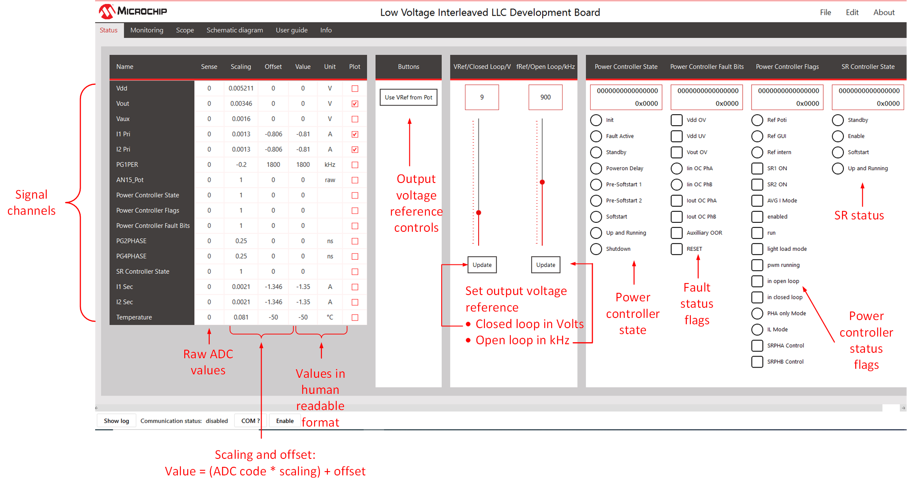

 

--- 
# dsPIC33 Interleaved LLC Converter <!-- omit in toc --> 
### 2 phase Interleaved LLC converter with voltage mode control and phase current balancing. <!-- omit in toc --> 

<a target="_blank" href="https://www.microchip.com/en-us/development-tool/DV330102" rel="nofollow">
dsPIC33 Interleaved LLC Converter Power Board
</a>

- - -

 

## Table of Contents <!-- omit in toc --> 

- [__Summary__](#summary)
- [__Related Collateral__](#related-collateral)
  - [__Software Used__](#software-used)
  - [__Hardware Used__](#hardware-used)
- [__How to Use This Document__](#how-to-use-this-document)
- [__Modes of Operation: Single Phase or Interleaved__](#modes-of-operation-single-phase-or-interleaved)
- [__Quick Start Guide__](#quick-start-guide)
  - [__Human Machine Interface__](#human-machine-interface)
  - [__Testing the Board in Open-Loop Mode__](#testing-the-board-in-open-loop-mode)
  - [__Testing the Board in Closed-Loop Mode__](#testing-the-board-in-closed-loop-mode)
  - [__Setting Up and Connecting the Board Power Visualizer GUI__](#setting-up-and-connecting-the-board-power-visualizer-gui)
- [__Firmware Overview__](#firmware-overview)
- [__Converter State Machine__](#converter-state-machine)
  - [__Soft-Starting the Converter__](#soft-starting-the-converter)
    - [__State PCS_SOFT_START_PRE1__](#state-pcs_soft_start_pre1)
    - [__State PCS_SOFT_START_PRE2__](#state-pcs_soft_start_pre2)
    - [__State PCS_SOFT_START__](#state-pcs_soft_start)
- [__Fault Protection__](#fault-protection)
  - [__Firmware Fault Protection__](#firmware-fault-protection)
  - [__Hardware fault protection__](#hardware-fault-protection)
- [__PWM Setup__](#pwm-setup)
  - [__PWM Routing__](#pwm-routing)
    - [__Phase A PWM Setup__](#phase-a-pwm-setup)
    - [__Phase B PWM Setup__](#phase-b-pwm-setup)
- [__Control Method__](#control-method)
  - [__Plant Measurement__](#plant-measurement)
  - [__Loop Measurements__](#loop-measurements)
- [__Phase Current Balancing__](#phase-current-balancing)
  - [__SR Drive State Machine__](#sr-drive-state-machine)
    - [__STANDBY State__](#standby-state)
    - [__ENABLE State__](#enable-state)
    - [__SOFTSTART State__](#softstart-state)
    - [__UP AND RUNNING State__](#up-and-running-state)
  - [__Results__](#results)
- [__Plant Frequency Response Simulation with MPLAB® Mindi™__](#plant-frequency-response-simulation-with-mplab-mindi)

---

## __Summary__

This solution demonstrates the implementation of an interleaved (2 phase) LLC converter using voltage mode control on the 50W Interleaved LLC Converter Development Board.

The 50W Interleaved LLC Converter Development Board is a generic development 
board for this topology that supports rapid prototyping and code development based on dsPIC33 devices. The board provides two identical half-bridge stages with LLC tank circuitry at the primary and voltage doubler rectification at the secondary. The board offers well organized building blocks that include an input filter, power stage, AUX supply, mating socket for Microchip’s newest Digital Power Plug-In Modules (DP PIMs), Human Machine Interface (HMI) and test points.
The electrical characteristics are prepared to allow safe voltage levels of up to 50 VDC in and up to 12 VDC out. Topology and design are scalable and can be easily turned into real industrial demands targeting 400 VDC or 800 VDC bus operating voltage. A mating socket for dsPIC33 plug-in modules allows the system to be evaluated with different controllers. The pinout is compatible for EP, CK and CH dsPIC® DSC DP PIMs. A Human-Machine-Interface (HMI) and test points allow for easy evaluation and debugging.

[[back to top](#start-doc)]

- - -

## __Related Collateral__

The related documentation can be found on the appropriate product website
- [Interleaved LLC Development Board](https://www.microchip.com/en-us/development-tool/DV330102)
- [dsPIC33CK256MP508 Family Data Sheet](https://www.microchip.com/70005349)
- [dsPIC33CK256MP508 Family Silicon Errata and Data Sheet Clarification](https://www.microchip.com/80000796)

Please always check for the latest data sheets on the respective product websites:
- [dsPIC33CK256MP508 Family](https://www.microchip.com/dsPIC33CK256MP508)
- [dsPIC33CH512MP508 Family](https://www.microchip.com/dsPIC33CH512MP508)

### __Software Used__
- [Power Board Visualizer GUI](https://www.microchip.com/SWLibraryWeb/product.aspx?product=POWER_BOARD_VISUALIZER)
- [MPLAB&reg; X IDE v5.45](https://www.microchip.com/mplabx-ide-windows-installer)
- [MPLAB&reg; XC16 Compiler v1.61](https://www.microchip.com/mplabxc16windows)
- [Microchip Code Configurator v4.0.2](https://www.microchip.com/mplab/mplab-code-configurator)
- [Digital Compensator Design Tool](https://www.microchip.com/developmenttools/ProductDetails/DCDT)
- [MPLAB&reg; Mindi™ Simulator](https://www.microchip.com/SWLibraryWeb/producttc.aspx?product=AnalogSimMPLABMindi)

### __Hardware Used__
- Interleaved LLC Development Board, Part-No. [DV330102](https://www.microchip.com/en-us/development-tool/DV330102)
- dsPIC33CK256MP506 Digital Power PIM, Part-No. [MA330048](https://www.microchip.com/MA330048)

[[back to top](#start-doc)]

- - -

## __How to Use This Document__
This document is intended as a supplement to the user's guide. We recommend that the user's guide is studied before reading this document. 
The user's guide can be found [here.](https://www.microchip.com/en-us/development-tool/DV330102).

[[back to top](#start-doc)]

- - -

## __Modes of Operation: Single Phase or Interleaved__

The LLC power board contains two phases, phase A and phase B. The firmware can be configured to run a single phase (phase A), or run in interleaved mode (phase A and phase B running).

To configure the mode of operation, open the header file "project_settings.h".

  

    
     
    Location of project_settings.h
  

Scroll down to line 58. 

To run in interleaved mode, POWER_STAGE_CONFIG_INTERLEAVED needs to be defined and POWER_STAGE_CONFIG_PHASE_A_ONLY should not be defined.

To run in phase A only, POWER_STAGE_CONFIG_PHASE_A_ONLY needs to be defined and POWER_STAGE_CONFIG_INTERLEAVED  should not be defined.

If neither or both are defined, you will get a compile error.

  

    
     
    Configuration #defines
  

- - -

## __Quick Start Guide__

In this section we describe how to bring up the board both in open loop and closed loop modes, with and without the Board Power Visualizer GUI.

### __Human Machine Interface__

The ILLC board has a simple Human-Machine-Interface (HMI) with LEDs showing status and push buttons for control. This is shown below.

  

    
     
    HMI LEDs and push buttons on the ILLC power board
  

The USER button control is outlined in the table below.

  

    
     
    HMI control USER push button action
  

The board status as shown by the LEDs on the ILLC power board and the DP-PIM is outlined below.

  

    
     
    HMI status LEDs
  

### __Testing the Board in Open-Loop Mode__

  

    
     
    Hardware connections
  

Note that we use the ICD4 in-circuit debugger to program the dsPIC, but any type of Microchip In-Circuit Debugger can be used here.

1. Connect computer to DP-PIM via USB cable
2. Connect computer to ICD4, connect ICD4 to 6 pin header on DP-PIM
3. Connect poti to 6 pin header on LLC power board as shown above
4. Set poti wiper to max setting
5. Connect input terminal of LLC power board to DC source capable of providing at least 40V. Leave DC source off for now.
6. Connect scope probe to TP100 (this is phase A high-side primary drive signal, ensuring to ground the scope at GND_S (not GND_P).
7. Connect a voltmeter to the output terminals of the LLC power board.
8. Connect output terminals of LLC power board to resistor or constant current load (set to around 0.5A or 20R), turn on the load if it is an e-load
9. Open illc project in MPLABx. Set as main project, then download the firmware to the dsPIC on the DP-PIM 
10. When the firmware is running, you should see 
   * the red LED on the DP-PIM slow blinking, indicating that the firmware is running
   *  the green LED on the power board slow blinking, indicating that the power supply is not running
   *  the red LED on the power board is on, indicating that a fault is active
11. Turn on the DC source, setting it to 40V. Set current limit to 1.2A or lower.
12. Short press the user button on the LLC power board. This turns on the converter. The status LED should be as follows
    * Green LED on power board on, indicating that the power supply is running
    * Red LED on power board slow-blinking, indicating that open-loop mode is active
13. Check the PWM signal on TP100 with a scope. It should have a frequency of around 1MHz, and a duty cycle of around 45%. 
14. Check the output voltage, with 0.5A load, it should be around 7.4V.
15. Move the poti wiper towards the min setting, observe the signal on TP100 and the output voltage, you should see the frequency of the signal on TP100 decreasing, the duty staying (approximately) the same, and the output voltage increasing. 
16. With the poti wiper at the min setting, the signal on TP100 should have a frequency of 800kHz and a duty cycle of 45%. With a 0.5A load, the output voltage should be around 10.7V.

Note that at power-up, the firmware checks if a potentiometer is connected, and if so, uses the voltage on the potentiometer wiper for the output voltage reference. If a potentiometer is not connected, the output voltage reference is set at 9V. 

### __Testing the Board in Closed-Loop Mode__

1. Turn off the power supply if it is running by short pressing the USER button.
2.  Press and hold the USER button for at least two seconds to change the working mode from open loop to closed loop. The red LED on the power board should turn off.
3.  Short press the USER button to enable the power supply.
4.  Check for valid output voltage and switching signal on TP100.
5.  If the potentiometer is connected, moving the potentiometer wiper position will change the output voltage reference.
6.  If the potentiometer is not used, the output voltage should be around 9V (TP100 signal should have frequency of around 870kHz and duty of 45%).
7.  Using the board in closed-Loop mode creates a controlled stable output voltage. It must be independent from input voltage or load changes. The reference for the output voltage can be set with a potentiometer and/or with the GUI. We discuss using the Board Power Visualizer GUI in the next section.

[[back to top](#start-doc)]

- - - 

### __Setting Up and Connecting the Board Power Visualizer GUI__

1.  Ensure that the firmware is running on the DP-PIM and that the DP-PIM is connected to your computer via a USB cable.
2.  Open the board power visualizer application on your computer.
3.  On the window that appears, click "Open Project", then navigate to the "gui" folder in the ILLC firmware installation directory, and click on "ILLC_R1.xml". 
4.  The ILLC landing page will open. Click on the "COM?" button on the bottom of this page.
5.  Select the port which is used for the serial connection between your computer and the DP-PIM from the pull-down menu. Click "OK" and you will be brought back to the ILLC GUI landing page.
6.  Click on the "Enable" button on the bottom of the landing page. This will initiate comms between the GUI and the firmware running on the DP-PIM.
7.  When the comms is working, the "Communication status" indicator on the bottom of the LLC GUI landing page should flash alternating red and green.

With Microchips Power Board Visualizer GUI we can easily visualize values and states visible on the ILLC Demo Board. We can also change the output voltage reference (closed loop) and switching frequency (open loop) on the running power supply with the GUI.
On the Status tab we have an example showing the main values like voltages and currents as well as status bits from the power controller and Faults.

  

    
     
    Board Power Visualizer Landing Page
  

On the Schematic diagram tab there is the power supply block diagram with online updates of the most important values for easy understanding the working principles. This is shown below.

  

    
     
    Board Power Visualizer Landing Page
  

[[back to top](#start-doc)]

- - -

## __Firmware Overview__

An overview of the firmware is shown below. 
The power controller state machine and fault handler are executed every 100us by the scheduler. So also are the GUI handler is run every 1ms, and the HMI driver every 100ms.

There are 5 interrupt sources.
* ISRADCCANO: executed every 6th phase A PWM cycle. Measure phase A secondary current and Vout every pass, then cycle through sampling other ADC channels on the shared core. Voltage loop is executed here, as well as SR state machine.
* ISRADCCAN1: executed every 6th phase B PWM cycle. Measure phase B secondary current.
* ISRSCCP1: triggered every 4th input capture event (SCCP peripheral), used to measure Vdd via a PWM signal from primary side whose duty cycle is proportional to the Vdd level.
* ISRCMP1: triggered if comparator 1 trips, which happens if there is a large output over current on phase A.
* ISRCMP3: triggered if comparator 3 trips, which happens if there is a large output over current on phase B.

  

    
     
    Firmware overview
  

[[back to top](#start-doc)]

MCC is used to configured the peripherals, and they are configured at run-time at the start of _main()_, before the background loop is initiated.

The main files are as follows:
* _driver/drv_adc.c_: this contains the 5 interrupt service routines.
* _power_controller/drv_pwrctrl_ILLC.c_: power controller state machine that is executed every 100us
* _power_controller/drv_pwrctrl_ILLC_fault.c_: fault handlers
* _power_controller/drv_pwrctrl_ILLC_ILPH_SRandControl.c_: power supply voltage loop and SR state machine and driver functions when running in interleaved mode.
* _power_controller/drv_pwrctrl_ILLC_PHA_SRandControl.c_: contains power supply voltage loop and SR state machine and driver functions when running phase A only.
* _misc/fault_common.c_: generic fault functions

  

    
     
    Firmware block diagram
  

  

    
     
    Firmware block details
  

[[back to top](#start-doc)]

- - - 

## __Converter State Machine__

The main power controller state machine is illustrated below. It is run every 100us. The code is located in _power_controller/drv_pwrctrl_ILLC.c_, see the function _Drv_PwrCtrl_ILLC_Task_100us()_. Most of the states are pretty standard. Perhaps the only states worth describing in detail are the soft-start states, as these differ a bit from other DC/DC converter state machines. Hence we describe these below.

  

    
     
    Power supply state machine
  

### __Soft-Starting the Converter__

The soft-start ramp is split in 2 parts
1. Open loop, fixed frequency of 1MHz (max frequency for our design), ramp duty cycle in steps of 2.5ns every 100us until duty reaches 50%.
2. Closed loop, fix duty cycle at 50%, ramp control loop input from pre-bias output voltage to target output voltage setpoint.

This first part is to prevent massive inrush current: this may happen if the duty cycle was set immediately to 50%. 

Note that the SRs drives (PWM2 for phase A and PWM4 for phase B) are switched off during soft-start, so any output current conduction is through the body diodes of the SRs during this time.

Also note that if we are running in interleaved mode, PG3 setup is identical to PG1, but PG3 lags PG1 by 90 degrees. 

#### __State PCS_SOFT_START_PRE1__

In this state, the PWMs are running open loop (that is, they are not driven by the compensator).
The frequency is fixed at 1MHz. The on-time of the primary side half-bridge drive signals is set to 50ns. 
Then every 100us, the on-time (and hence duty cycle) is increase by 2.5ns.
This continues until the duty cycle is 45% (as we allow for a dead-time of 50ns).

  

    
     
    Half bridge high and low switching signals at power-on
  

  

    
     
    Half bridge high and low switching signals during open-loop duty cycle ramp, with fixed Fsw = 1MHz
  

Once we reach the target on-time, we move to the state PCS_SOFT_START_PRE2.

#### __State PCS_SOFT_START_PRE2__

In this state, we enable frequency modulation of the PWM outputs by the voltage mode compensator. The duty cycle of the PWM drive signals is fixed at (PG1PER/2 - 50ns). The voltage loop reference is initialized based on the measured output voltage at this point. 

#### __State PCS_SOFT_START__

In this state, the reference to the voltage loop compensator is ramped linearly to the target setpoint. The compensator controls the frequency of the primary side LLC half-bridge signals. The duty cycle is always set to (PG1PER/2 - 50ns).

Note that in this state the SRs are enabled.

A oscilloscope screenshot of the entire start up phase is shown above. The different parts are described also.

  

    
     
    Soft-start with different stages highlighted and described
  

[[back to top](#start-doc)]

- - -

## __Fault Protection__

The fault protection code is executed every 100us at the start of the converter state machine in the function _Drv_PwrCtrl_ILLC_Fault_Check()_. The body of the fault code is located in the files _power_controller/drv_pwr_ctrl_ILLC_fault.c_ and _misc/fault_common.c_.

There are two types of protection on this project.
1. Firmware fault protection
2. Hardware fault protection

The firmware fault protection is implemented on the dsPIC on the DP-PIM. The hardware fault protection is implemented on the LLC power board. It's purpose is to prevent catastrophic board damage, particularly due to input and output over current events.

### __Firmware Fault Protection__

All of our firmware fault protection has the same functionality. Each fault has a trigger threshold, a clear threshold, a fault blanking time and a fault clear time.

This is illustrated below, for a fault with a "max" threshold, which means that the fault is triggered when the fault source is above a threshold (output over voltage protection, for example).

Once the fault source breaches the trigger threshold, a timer is started. If the fault source stays above the trigger threshold for longer than the fault blanking time, then the fault becomes active, the PWMs are switched off and the converter state machine goes to "FAULT ACTIVE" state. During the fault blanking time, if the fault source drops back below the trigger threshold, the timer is reset.  

When the fault is active. if the fault source stays below the fault clear threshold for the fault clear time, then the fault is cleared. When all fault sources are cleared, the converter will attempt to restart.

  

    
     
    Firmware Fault protection
  

This is shown in more detail in a flowchart below. When "fault active == true", then the fault is active and the converter is disabled. When "fault active == false" the converter can attempt to start up.

  

    
     
    Flowchart illustrating the firmware fault protection
  

All faults shown in the table below have firmware protection like this. In our firmware, this fault protection is run every 100us.

  

    
     
    ILLC faults with firmware protection
  

### __Hardware fault protection__

The purpose of the hardware fault protection is to prevent catastrophic board damage, particularly from input or output over current. 
Once triggered, it kicks in immediately (there is no fault blanking time). It sets all PWM drive signals to 0, which will turn off the converter. Note that this is completely independent of the dsPIC, so even if there are drive signals coming from the dsPIC when the hardware fault protection is tripped, they will be forced to 0V (through AND gates on the hardware) before they get to the FET drivers. 

  

    
     
    ILLC faults with hardware protection
  

If the hardware fault protection is triggered, the red LED LD700 will turn on. The protection is latched, meaning that once triggered it will not clear itself, it needs to be manually cleared.

If you want to re-run the board, you need to 
* disable all PWMs first, either by holding down the RESET push button, or erasing the dsPIC firmware (we recommend the second option as it is safer)
* then short press the "RESET protection" push button on the HMI interface. 

On the dsPIC, output over current protection using comparators and DAsC is also implemented as follows:
* Current transformer phase A secondary sense tied to CMP1DAC (pin 22 of dsPIC)
* Current transformer phase B secondary sense tied to CMP3DAC (pin 18 of dsPIC)

Either of these comparators tripping will trigger the highest priority interrupt, which disables all PWM drive signals and puts the converter in the "FAULT ACTIVE" state.
Like the hardware fault protection, this fault protection is also latched, meaning that the dsPIC needs to be reset to restart the converter. If this fault protection is triggered, the RESET flag in the Board Power Visualizer GUI will be set, as shown below, indicating that the dsPIC needs to be reset to re-start the LLC converter.

  

    
     
    ILLC faults with hardware protection
  

[[back to top](#start-doc)]

- - -

## __PWM Setup__

Most of the PWM setup is done by calling MCC generated initialization functions at the top of _main()_. Some configuration is also done at runtime as required.

### __PWM Routing__
The two schematics below show the routing of the PWM signals for phase A and phase B. PWM1 and PWM3 output are used for the primary drives for phase A and phase B respectively, while PWM2 and PWM4 are used for the SR drives.

The dsPIC33C is on the secondary side, so PWM1H, PWM1L, PWM3H and PWM3L have to pass through the isolation barrier. FET drivers are not shown here, please see the schematic on the users guide for more detail.

  

    
     
    PWM routing for phase A
  

  

    
     
    PWM routing for phase B
  

The switching frequency range of our LLC solution is from 800kHz and 1Mhz. To achieve robust operation in this frequency range with a PWM resolution of 250ps, we needed some special PWM module configuration, which will be describe in the following sections.

#### __Phase A PWM Setup__

For a single phase, the LLC primary drive signals should have a fixed duty cycle (just below 50%) and variable frequency, as shown below. The drive signals to the high side and low side of the primary side half-bridge (before the resonant tank) need to be complementary, with a dead time between the falling edge on the high side drive and the rising edge of the low side drive, and visa-versa. 

In our example firmware, the frequency varies from 800kHz to 1MHz.

To get this type of waveform from the PWM module, we configured the PWM peripherals in "Independent Edge, dual output mode". 

In this mode of operation, each PWM edge is set independently via a register. Specifically,
* PWM1H rising edge occurs when PWM1 counter = PG1PHASE.
* PWM1H falling edge occurs when PWM1 counter = PG1DC.
* PW1L rising edge occurs when PWM1 counter = PG1TRIGA.
* PWM1L falling edge occurs when PWM1 counter = PG1TRIGB.

The primary drive signals for phase A (from PWM1 peripheral) are shown below.

  

    
     
    PWM1 setup
  

  

    
     
    PWM mode: independent edge, dual output
  

The SR drive signals for phase A come from the PWM2 module. PWM2H drives the SR on the high side of the half-bridge on the secondary side, and PWM2L drives the SR on the low-side. PWM2 is also configured in "independent edge, dual output" mode, but the SWAP bit is set, so that PWM2H and PWM2L are swapped.
The PWM2H and PWM2L setup is illustrated below.

  

    
     
    PWM2 setup
  

#### __Phase B PWM Setup__

Phase B setup as follows:

* PWM3H drives primary side half-bridge, high side
* PWM3L drives primary side half-bridge, low side
* PWM4H drives secondary side (SR) half-bridge, high side
* PWM4L drives secondary side (SR) half-bridge, low side

Phase A and phase B run 90 degrees out of phase. 
The synchronization scheme works as follows
* PWM2 is synchronized to the EOC (End of Cycle) trigger of PWM1, so they run in phase
* PWM3 is synchronized to PG2TRIGC via the PWM2 peripheral's PCI input and the PWM event A output. PG2TRIGC is set to (PG1PER / 4 ), so the PWM3 cycle starts 1/4 of a period after PWM1 and PWM2 cycle start.
* PWM4 is synchronized to the EOC (End of Cycle) trigger of PWM3, so they run in phase.

  

    
     
    phase A and phase B sync
  

The ADC trigger for PWM1 is set to occur every 6th PWM1 period. It is set using PG1TRIGC (as PG1TRIGA and PG1TRIGB are already in use), and in the running firmware is set to be at the middle of the PG1H on-time so as to sample the average current.

The ADC trigger for PWM3 is set to occur every 6th PWM3 period. It is set using PG3TRIGC, and in the running firmware is set to be at the middle of the PG3H on-time so as to sample the average current.

The "easy setup" view for all 4 PWM modules is shown below.

  

    
     
    PWM configuration in MCC (easy setup)
  

Some registers in the "registers" view also need to be modified. The fields that need to be modified for phase A (related to PWM1 and PWM2) are highlighted below.

  

    
     
    Phase A configuration in MCC (additional register settings)
  

The fields that need to be modified for phase B (related to PWM3 and PWM4) are highlighted below.

  

    
     
    Phase B configuration in MCC (additional register settings)
  

[[back to top](#start-doc)]

- - -

## __Control Method__

Uses voltage mode control.

  

    
     
    Block diagram of LLC control loop with current balancing 
  

### __Plant Measurement__

Discuss how to do this on DP-PIM

[[back to top](#start-doc)]

---

### __Loop Measurements__

[[back to top](#start-doc)]

---

## __Phase Current Balancing__

A current balancing scheme has been implemented on the demo firmware accompanying this board. The goal is that both phases share the load current equally. This scheme is only run if the total load current is above 1.4A (see the macro _IOUT_SRONIL_ in the firmware), so the thermal stress is shared equally between the phases when the load is high enough that thermal management is warranted.
The code is located in the function _Drv_PwrCtrl_ILLC_ILPHVoltageLoop()_, which is in the file _power_controller/drv_pwrctrl_ILLC_SRandControl.c_. This function is called from the ADCAN0 interrupt, which is located in the file _driver/drv_adc.c_. 

  

    
     
    Block diagram of LLC control loop with current balancing 
  

The scheme works by changing the duty cycle of the SR drive signals on one phase until the currents are approximately the same, while keeping the duty cycle of the SR drives on the other phase fixed. When the scheme is launched, the (filtered) currents of both phases are compared. The phase with the smaller current runs at a fixed (just under 50%) duty cycle, while the duty cycle of the SRs on the phase with the larger current is varied between a min value (100ns) and a max value (just under 50%) until the two currents are as close as possible.

Decreasing the duty cycle of the SR drives on a phase will decrease the amount of current flowing through this phase and increase the amount of current flowing through the other phase. The total output current remains the same.

### __SR Drive State Machine__

  

    
     
    Current balancing state machine
  

The state machine that runs the current balancing algorithm is illustrated above. It is run in the ADCAN0 interrupt, which is executed every 6th PWM period. 

 
 

#### __STANDBY State__
Both SRs are disabled, so any conduction is through the body diodes of the SRs. We stay in this state until the output voltage is above 6V (see macro _VOUT_SR_ACTIVE_) and the total output current is above 1.4A (see macro _IOUT_SRONIL_). If both of these conditions are satisfied we go to the enable state. 

  

    
     
    Flowchart for STANDBY state
  

 

#### __ENABLE State__

Both SRs are still disabled. The two phase currents are compared. In our current balancing algorithm, the phase with the smaller current has a fixed SR duty cycle, and the SR duty of the other phase is varied to get the currents in balance. So the decision on which phase to fix and which to vary is made once at this point, and remains in force while the algorithm is active.

Note that the phase current measurements used for the comparison are filtered to reduce the effect of noise on the decision.

  

    
     
    Flowchart for ENABLE state
  

After the comparison is made, PWM2 and PWM4 (the PWMs used to drive the SRs for phase A and phase B respectively) are enabled and set at min duty cycle. The PWM setup is actually done in the STANDBY state, but the PWM outputs from the dsPIC are not enabled until the ENABLE state.

  

    
     
    PWM 2 setup
  

As discussed in section XXX, the PWMs are configured in "Independent, dual output" mode. To recap, PG2 is used to drive the SRs for phase A, and PG4 is used to drive the SRs for phase B. 

For phase A, the rising edge of PWM2H is set via the PG2TRIGA register (so the event is triggered when the internal period counter in PG2 reaches PG2TRIGA), and the falling edge set via PG2TRIGB. The rising edge of PWM2L is set by the PG2PHASE register, and the falling edge via the PG2DC register. 

For phase B SR drive, PG4 is used, so PG4TRIGA, PG4TRIGB, PG4PHASE and PG4DC are used to set the rising and falling edges on PG4H and PG4L in the same way as for PG2. 

 

#### __SOFTSTART State__

In this state, the duty cycles of the SR drives on both PG2 and PG4 are linearly ramped from the min duty (100ns pulse width) to the max duty (PGxPER/2*250ps - 124ns) in steps of 10ns.

  

    
     
    PWM 2 setup
  

The falling edges of the PWM2 and PWM4 outputs are fixed during the ramping of the duty cycle, and the rising edges are moved.
For PG2, PG2TRIGB is fixed at 50ns before the end of period, and PG2DC fixed at 50ns before the end of the half-period. For PG4, PG4TRIGB is fixed at 50ns before the end of period, and PG4DC fixed at 50ns before the half-period.  

During the soft-start ramp, PG2TRIGA, PG2PHASE, PG4TRIGA and PG4PHASE are decreased by steps equivalent to 10ns so that the duty cycle increases by 10ns each time.

The ramp is stopped when the rising edge of PG2PHASE is 74ns from the start of the period. Thus at the end of the ramp, all SR drive signals are running at just under 50% duty cycle (precisely, this is [PG2PER/2*250ps] - 124ns).

At the end of the ramp, we change to the UP AND RUNNING state.

 

#### __UP AND RUNNING State__

  

    
     
    Flowchart illustrating the UP AND RUNNING state
  

In this state, one of the SR drives of either phase A or phase B runs at a fixed duty cycle, and the other is moved. The decision on which phase to fix and which to vary is made in the ENABLE state and doesn't change thereafter. 

If the output current through the phase being controlled is greater than the current through the other (fixed duty) phase, we decrease the duty cycle of the SR drives by 2ns. If the current is smaller, we increase the duty cycle on the SR drives by 2ns. The on-time of the SR drives is clamped at a max value of [PGxPER/2*250ps - 124ns], and at a min value of 100ns.

If the total output current drops below 1.0A (see macro _IOUT_SROFFIL_), all SR drives are disabled, and we go back to the STANDBY state.

### __Results__
See results below. The two phase currents are out of balance until the total output current reaches 1.4A, at which point the current balancing algorithm kicks in, and the current is shared equally between the phases.

  

    
     
    Current Balancing
  

Below we show how it works with a load step from 0 to 3A. The time-base is 200us/div, so you can see that the currents are in balance within 1.5ms.

  

    
     
    Current Balancing with load step
  

[[back to top](#start-doc)]

- - -

## __Plant Frequency Response Simulation with MPLAB® Mindi™__
Mindi™ is the Microchip-branded demo version of Simplis/SiMetrix. It supports the common features of the Simplis standard license but limits the number of circuit nodes. 

[[back to top](#start-doc)]

---

&copy; 2021, Microchip Technology Inc.
