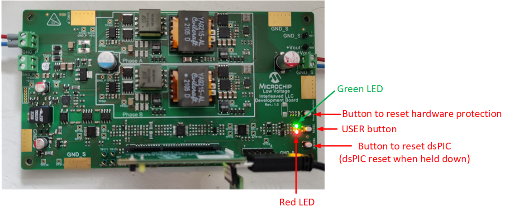
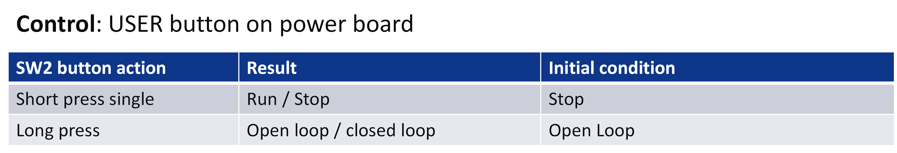

---

# dsPIC33 Interleaved LLC Converter

### 2 phase Interleaved LLC converter with voltage mode control and phase current balancing. 

<a target="_blank" href="https://www.microchip.com/en-us/development-tool/EV84C64A" rel="nofollow">
dsPIC33 Interleaved LLC Converter Power Board.
</a>

---

## Summary

This solution demonstrates the implementation of an interleaved (2 phase) LLC converter using voltage mode control on the 50W Interleaved LLC Converter Development Board.

The 50W Interleaved LLC Converter Development Board is a generic development board for this topology that supports rapid prototyping and code development based on dsPIC33 devices. The board provides two identical half-bridge stages with LLC tank circuitry at the primary and voltage doubler rectification at the secondary. The board offers well organized building blocks that include an input filter, power stage, AUX supply, mating socket for Microchip’s newest Digital Power Plug-In Modules (DP PIMs), Human Machine Interface (HMI) and test points.
The electrical characteristics are prepared to allow safe voltage levels of up to 50 VDC in and up to 12 VDC out. Topology and design are scalable and can be easily turned into real industrial demands targeting 400 VDC or 800 VDC bus operating voltage. A mating socket for dsPIC33 plug-in modules allows the system to be evaluated with different controllers. The pinout is compatible for EP, CK and CH dsPIC® DSC DP PIMs. A Human-Machine-Interface (HMI) and test points allow for easy evaluation and debugging.

[[back to top](#start-doc)]
- - -

## Highlights

- Digitally-Controlled Two-Phase Interleaved LLC Resonant DC-DC Converter.
- Accurate current sharing between phases without any additional hardware.
- Utilization of dsPIC peripherals to achieve switching frequency range between 800kHz and 1MHz.
- Soft-start with both duty cycle and frequency modulation for smooth output voltage ramp without current surges.

[[back to top](#start-doc)]

- - -

## Related Documentation

__Firmware documentation__

- [Online Firmware Documentation of this Code Example](https://microchip-pic-avr-examples.github.io/lvllc-power-voltage-mode-control-with-active-current-sharing/)

__Hardware Documentation__

- [Interleaved LLC Development Board Product Webpage](https://www.microchip.com/en-us/development-tool/EV84C64A)

__Target Device Documentation__

- [dsPIC33CK256MP508 Family Data Sheet](https://www.microchip.com/70005349)
- [dsPIC33CK256MP508 Family Silicon Errata and Data Sheet Clarification](https://www.microchip.com/80000796)

__Please always check for the latest data sheets on the respective product websites:__

- [dsPIC33CK256MP508 Family](https://www.microchip.com/dsPIC33CK256MP508)
- [dsPIC33CH512MP508 Family](https://www.microchip.com/dsPIC33CH512MP508)

- - -

## Software Used

- [Power Board Visualizer GUI](https://www.microchip.com/SWLibraryWeb/product.aspx?product=POWER_BOARD_VISUALIZER)
- [MPLAB&reg; X IDE v5.50](https://www.microchip.com/mplabx-ide-windows-installer)
- [MPLAB&reg; XC16 Compiler v1.70](https://www.microchip.com/mplabxc16windows)
- [Microchip Code Configurator v5.0.3](https://www.microchip.com/mplab/mplab-code-configurator)
- [Digital Compensator Design Tool](https://www.microchip.com/developmenttools/ProductDetails/DCDT)
- [MPLAB&reg; Mindi™ Simulator](https://www.microchip.com/SWLibraryWeb/producttc.aspx?product=AnalogSimMPLABMindi)

## Hardware Used

- Interleaved LLC Development Board, Part-No. [EV84C64A](https://www.microchip.com/en-us/development-tool/EV84C64A)
- dsPIC33CK256MP506 Digital Power PIM, Part-No. [MA330048](https://www.microchip.com/MA330048)

[[back to top](#start-doc)]

- - -

## Quick Start Guide

In this section we describe how to bring up the board both in open loop and closed loop modes, and with and without using the Power Board Visualizer GUI.

### Human Machine Interface

The interleaved LLC board has a simple Human-Machine-Interface (HMI) with LEDs showing status, and push buttons for control. This is shown below.

  

    
     
    HMI LEDs and push buttons on the ILLC power board.
  

The USER button control action is outlined in the table below.

  

    
     
    HMI control USER push button action.
  

The board status as shown by the LEDs on the ILLC power board and the DP-PIM is outlined below.

  

    
     
    HMI status LEDs.
  

[[back to top](#start-doc)]
- - -

### Testing the Board in Open-Loop Mode

The hardware connections for running the board in open loop mode is shown below.

  

    
     
    Hardware connections.
  

Note that we use the ICD4 in-circuit debugger to program the dsPIC, but any type of Microchip In-Circuit Debugger can be used here.

Please follow these steps to run the ILLC board in open loop mode.

(1) Connect computer directly to DP-PIM via USB cable (USB Micro Type-B on DP-PIM).

(2) Connect computer to ICD4 via USB cable, connect ICD4 to 6 pin header on DP-PIM via RJ11 cable and RJ11 to ICSP adapter.

(3) Connect poti (5kR or 10kR) to 6 pin header on LLC power board as shown above.

(4) Set poti wiper to max setting.

(5) Connect input terminal of LLC power board to DC source capable of providing at least 40V. Leave DC source off for now.

(6) Connect scope probe to TP100 (this is phase A high-side primary drive signal) ensuring to ground the scope at GND_S (not GND_P).

(7) Connect a voltmeter to the output terminals of the LLC power board.

(8) Connect output terminals of LLC power board to resistive or constant current load (set current load to around 0.5A or resistive load to around 20R), turn on the load if it is an e-load.

(9) Open ILLC project in MPLABx. Set as the main project, then download the firmware to the dsPIC on the DP-PIM.

(10) When the firmware is running, you should see

- the red LED on the DP-PIM slow blinking, indicating that the firmware is running.
- the green LED on the power board slow blinking, indicating that the power supply is not running.
- the red LED on the power board is on, indicating that a fault is active.

(11) Set the DC source to 40V. Set current limit to 1.2A or lower. Turn on DC source.

(12) Short press the USER button on the LLC power board. This turns on the converter. The status LEDs should behave as follows:
- Green LED on power board constant on, indicating that the power supply is running.
- Red LED on power board slow-blinking, indicating that open-loop mode is active.

(13) Check the PWM signal on TP100 with an oscilloscope. The signal should have a frequency of around 1MHz, and a duty cycle of 45%.

(14) Check the output voltage with the voltmeter: with 0.5A load, it should be around 7.4V.

(15) Move the poti wiper slowly towards the min setting. While doing this, observe the signal on TP100 and the output voltage, you should see the frequency of the signal on TP100 decreasing, the duty staying (approximately) the same, and the output voltage increasing.

(16) With the poti wiper at the min setting, the signal on TP100 should have a frequency of 800kHz and a duty cycle of 45%. With a 0.5A load, the output voltage should be around 10.7V.

Note that at power-up, the firmware checks if a potentiometer is connected, and if so, the voltage on the potentiometer wiper sets the output voltage reference. If a potentiometer is not connected, the output voltage reference is fixed at 9V. The firmware will not detect that the poti is present if the poti is connected after power up, so you need to reset the dsPIC if this is the case.

[[back to top](#start-doc)]
- - -

### Testing the Board in Closed-Loop Mode

1. Turn off the power supply if it is running by short pressing the USER button.
2. Press and hold the USER button for at least two seconds to change the working mode from open loop to closed loop. The red LED on the power board should turn off.
3. Short press the USER button to enable the power supply.
4. Check for valid output voltage and switching signal on TP100.
5. If the potentiometer is connected, moving the potentiometer wiper position will change the output voltage reference.
6. If the potentiometer is not used, the output voltage should be around 9V (TP100 signal should have frequency of around 870kHz and duty of 45%).
7. Using the board in closed-Loop mode creates a controlled stable output voltage. It must be independent from input voltage or load changes. The reference for the output voltage can be set with a potentiometer and/or with the Power Board Visualizer GUI.
  
  We discuss using the Power Board Visualizer GUI in the next section.

[[back to top](#start-doc)]

- - -

### Setting Up and Connecting the Power Board Visualizer GUI

1. Ensure that the firmware is running on the DP-PIM and that the DP-PIM is connected to your computer via a USB cable.
2. Open the Power Board Visualizer application on your computer.
3. On the window that appears, click "Open Project", then navigate to the "gui" folder in the ILLC firmware installation directory, and click on "ILLC_R1.xml".
4. The ILLC landing page will open. Click on the "COM?" button on the bottom of this page.
5. Select the port which is used for the serial connection between your computer and the DP-PIM from the pull-down menu. Click "OK" and you will be brought back to the ILLC GUI landing page.
6. Click on the "Enable" button on the bottom of the landing page. This will initiate comms between the GUI and the firmware running on the DP-PIM.
7. When the comms is working, the "Communication status" indicator on the bottom of the LLC GUI landing page should flash alternating red and green.

With Microchips Power Board Visualizer GUI we can easily visualize values and states visible on the ILLC Demo Board. We can also change the output voltage reference (closed loop only) and switching frequency (open loop only) on the running power supply with the GUI.

On the "Status" tab we show an example below with the main values like voltages and currents as well as status bits from the power controller and Faults.

  

    
     
    Power Board Visualizer Landing Page.
  

On the "Schematic diagram" tab there is the power supply block diagram with online updates of the most important values for easy understanding the working principles. This is shown below.

  

    
     
    Power Board Visualizer Schematic Diagram page.
  

[[back to top](#start-doc)]

- - -

&copy; 2021, Microchip Technology Inc.
